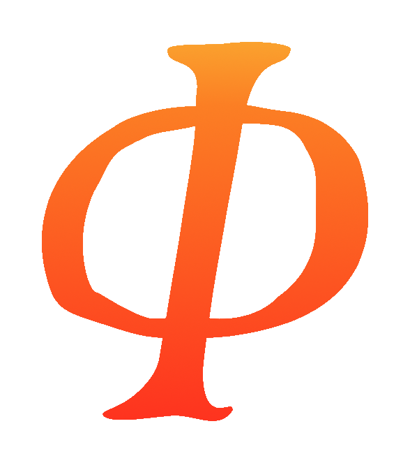

# Quantum Forge API Documentation

  

Welcome to the first step in creating a quantum world. Quantum Forge was born of a desire to make it easy to build the next generation of genuine quantum games. It has been years in the making, building from the lessons learned in the creation of [Quantum Chess](https://store.steampowered.com/app/453870/Quantum_Chess/), and has gone through many iterations. We're excited to share it with you. If you appreciate the vision and the effort that has gone into this project, consider supporting our work. 

Thank you for helping us explore what is possible in the ultimate creative expression of our quantum universe.

## [Getting Started](articles/getting-started.md)
Learn how to integrate Quantum Forge into your Unity project.

## [Advanced Topics](articles/advanced-topics.md)
Dive deeper into advanced features and use cases.

## [API Reference](api/index.md)
Explore the complete API documentation for the Quantum Forge Unity package.
